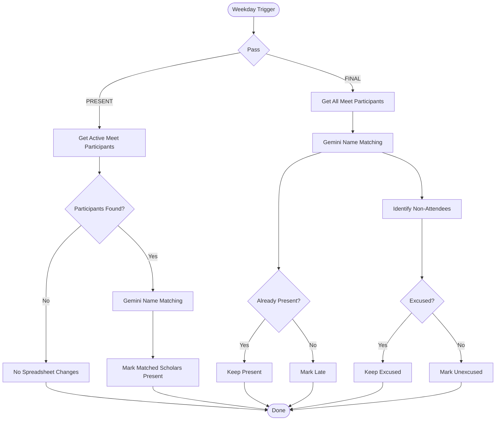
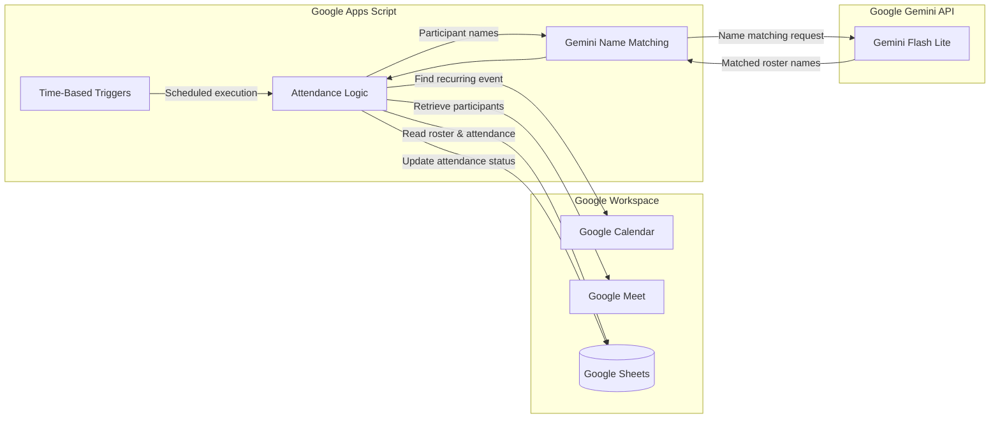

# GoogleMeetAutoAttendanceChecker

Automated Google Meet attendance tracking using Google Apps Script, the Google Meet REST API, Google Calendar API, Google Sheets, and Gemini for participant-name matching.

## Overview

`GoogleMeetAutoAttendanceChecker` automates attendance for a recurring Google Meet class or meeting.

The automation runs two attendance passes on weekdays:

1. **PRESENT PASS**
   - Finds today's occurrence of a configured recurring Google Calendar event.
   - Resolves its Google Meet conference.
   - Retrieves participants who are currently active.
   - Uses Gemini only to match Meet display names to the official roster.
   - Marks matched participants as `Present`.
   - If nobody is active, the spreadsheet is left completely unchanged.

2. **FINAL PASS**
   - Finds today's Meet conference.
   - Retrieves everyone who attended the meeting.
   - Uses Gemini to match participant names to the official roster.
   - Existing `Present` records remain `Present`.
   - Attendees who were not marked `Present` during the first pass become `Late`.
   - Everyone else becomes `Unexcused`.
   - Existing `Excused` records are never overwritten.

Attendance decisions are deterministic and are performed by Apps Script. Gemini is used **only for name matching**, not for deciding attendance status. This separation is intentional.

## Attendance Flow



## Requirements

- A Google Workspace account with access to the target:
  - Google Calendar event
  - Google Meet meeting
  - Google Sheets attendance tracker
- A Google Apps Script project
- Google Calendar API
- Google Meet REST API
- A Gemini API key
- A spreadsheet containing the official roster and attendance columns

The Google account used to authorize the script must have access to the Calendar event, Meet meeting, and attendance spreadsheet.

## Google Sheet Format

The spreadsheet must contain an authoritative roster/name column and an existing attendance column for each date.

For example:

| Names | AUG 3 | AUG 4 | AUG 5 | AUG 6 |
|---|---|---|---|---|
| Juan Dela Cruz | | | | |
| Maria Santos | | | | |
| Pedro Reyes | | | | |

The date headers are expected to use the `MMM d` format, such as:

```text
AUG 3
AUG 4
AUG 5
```

The year does not need to be included. The script determines the current month/day using the configured timezone and searches the configured date-header row for the matching existing column. 

### Important

The script **does not create missing date columns**.

If today's attendance column does not exist:

- an error is logged;
- execution stops;
- the spreadsheet is not modified.

This prevents the automation from silently changing the spreadsheet structure.

## Configuration

Edit the `CONFIG` object in `Code.gs`.

### Calendar / Meet

```javascript
CALENDAR_ID: 'primary',
RECURRING_EVENT_ID: 'YOUR_RECURRING_EVENT_ID',
```

`RECURRING_EVENT_ID` must be the ID of the **parent recurring Calendar event**, not the ID of an individual occurrence.

The Calendar event must contain the Google Meet conference information.

If you need to inspect today's Calendar events and IDs, run:

```javascript
listTodaysCalendarEvents()
```

The function logs each event's ID, recurring event ID, start time, and Meet link.

### Spreadsheet

Configure:

```javascript
SPREADSHEET_ID: 'YOUR_SPREADSHEET_ID',
SHEET_NAME: 'Attendance Tracker',

ROSTER_COLUMN: 1,
ROSTER_START_ROW: 2,
DATE_HEADER_ROW: 1,
```

These are **1-based** indexes.

For example:

```text
A = 1
B = 2
C = 3
D = 4
```

If names are in column A starting at row 2 and dates are in row 1:

```javascript
ROSTER_COLUMN: 1,
ROSTER_START_ROW: 2,
DATE_HEADER_ROW: 1,
```

The roster in the configured column is treated as the authoritative participant list.

### Attendance Times

Configure the two passes:

```javascript
PRESENT_PASS_HOUR: 13,
PRESENT_PASS_MINUTE: 30,

FINAL_PASS_HOUR: 15,
FINAL_PASS_MINUTE: 0,
```

The PRESENT pass checks currently active participants. The FINAL pass checks all participants who attended.

Google Apps Script time-based triggers execute approximately around the configured time rather than guaranteeing execution at the exact second.

### Attendance Statuses

The current implementation uses:

```javascript
STATUS_PRESENT: 'Present',
STATUS_LATE: 'Late',
STATUS_ABSENT: 'Unexcused',
STATUS_EXCUSED: 'Excused',
```

These values are written to the spreadsheet exactly as configured.

`Excused` is treated as a manually managed status and is never overwritten by the automation.

### Timezone

Configure the timezone used for attendance-date calculations and triggers:

```javascript
TIMEZONE: 'Asia/Manila',
```

Change this if the meeting operates in another timezone.

## Gemini Configuration

Configure the Gemini model:

```javascript
GEMINI_MODEL: 'gemini-3.5-flash-lite',
```

Gemini is deliberately restricted to participant-name matching.

It handles variations such as:

- capitalization differences
- punctuation differences
- spacing differences
- missing middle names or initials
- abbreviated names
- different name order
- minor spelling differences
- common display-name variations

Gemini must only match a participant to an existing roster entry. It must not invent people or determine whether someone is Present, Late, Unexcused, or Excused.

## API Key

Do **not** put the Gemini API key directly in `Code.gs`.

In Apps Script:

```text
Project Settings
    -> Script Properties
```

Create:

```text
Property: GEMINI_API_KEY
Value:    <your Gemini API key>
```

The script reads the key using `PropertiesService`.

## Apps Script Setup

### 1. Create the Apps Script project

Create a new Google Apps Script project and add the project source files, including `Code.gs` and `appsscript.json`.

### 2. Configure `appsscript.json`

The manifest must include these OAuth scopes:

```json
{
  "oauthScopes": [
    "https://www.googleapis.com/auth/calendar.readonly",
    "https://www.googleapis.com/auth/meetings.space.readonly",
    "https://www.googleapis.com/auth/spreadsheets",
    "https://www.googleapis.com/auth/script.external_request"
  ]
}
```

The project also requires the Google Calendar API to be added as an Apps Script advanced service:

```text
Apps Script
    -> Services
    -> Add a service
    -> Google Calendar API
```

These scopes and the Calendar advanced service are required by the current implementation.

### 3. Enable Google Cloud APIs

In the Google Cloud project associated with the Apps Script project, enable:

- Google Meet REST API
- Google Calendar API

### 4. Configure Script Properties

Add:

```text
GEMINI_API_KEY=<your Gemini API key>
```

Do not commit this value to GitHub.

### 5. Configure the `CONFIG` object

At minimum, configure:

```javascript
const CONFIG = {
  CALENDAR_ID: 'primary',
  RECURRING_EVENT_ID: 'YOUR_RECURRING_EVENT_ID',

  SPREADSHEET_ID: 'YOUR_SPREADSHEET_ID',
  SHEET_NAME: 'Attendance Tracker',

  ROSTER_COLUMN: 1,
  DATE_HEADER_ROW: 1,
  ROSTER_START_ROW: 2,

  PRESENT_PASS_HOUR: 13,
  PRESENT_PASS_MINUTE: 30,

  FINAL_PASS_HOUR: 15,
  FINAL_PASS_MINUTE: 0,

  STATUS_PRESENT: 'Present',
  STATUS_LATE: 'Late',
  STATUS_ABSENT: 'Unexcused',
  STATUS_EXCUSED: 'Excused',

  GEMINI_MODEL: 'gemini-3.5-flash-lite',

  TIMEZONE: 'Asia/Manila',
  MEET_PAGE_SIZE: 250
};
```

Do not publish your real spreadsheet ID if the repository is public unless that exposure is acceptable for your environment.

## Testing

Before installing production triggers, test the integration in stages.

### Calendar and Meet Lookup

Run:

```javascript
testCalendarAndMeetLookup()
```

Verify that:

- the correct Calendar occurrence is found;
- the configured recurring event is being used;
- the Meet code is detected;
- the Meet conference can be found.

### Current Participants

Run:

```javascript
testGetCurrentParticipants()
```

This retrieves participants who are currently active in the Meet conference.

### All Participants

Run:

```javascript
testGetAllParticipants()
```

This retrieves all participants recorded for the conference.

### Gemini Matching

Run:

```javascript
testGeminiMatching()
```

Verify that Meet display names are correctly matched against the official roster.

### Attendance Logic

The following functions execute the actual spreadsheet-writing logic:

```javascript
testPresentPassNow()
testFinalPassNow()
```

**These functions modify the spreadsheet.**

Only run them when you intentionally want to test attendance behavior.

## Production Deployment

After the individual tests pass, run:

```javascript
setupProduction()
```

This function:

1. Validates the configuration.
2. Removes existing attendance triggers created by this project.
3. Creates weekday triggers for the PRESENT pass.
4. Creates weekday triggers for the FINAL pass.

The current implementation creates 10 triggers in total:

```text
Monday       PRESENT + FINAL
Tuesday      PRESENT + FINAL
Wednesday    PRESENT + FINAL
Thursday     PRESENT + FINAL
Friday       PRESENT + FINAL
```

Running `setupProduction()` again is safe because the automation removes its existing attendance triggers before creating a fresh set.

## Attendance Rules

### PRESENT PASS

At the configured PRESENT time:

```text
Active in Meet
      |
      v
Gemini name matching
      |
      v
Roster member
      |
      v
Present
```

If no active participants are found, the spreadsheet remains unchanged.

Existing `Present` and `Excused` values are also preserved.

### FINAL PASS

At the configured FINAL time:

```text
Already Present  -> Present
Excused          -> Excused
Attended         -> Late
Did not attend   -> Unexcused
```

## Architecture



### Google Apps Script

Responsible for:

- scheduling and triggers;
- Calendar lookup;
- Meet API requests;
- spreadsheet access;
- attendance-status decisions;
- preserving `Excused`;
- preventing overlapping executions with `LockService`.

The script uses a script lock so simultaneous attendance executions do not process the same attendance workflow concurrently.

### Google Calendar API

Used to locate today's occurrence of the configured recurring Calendar event and obtain its Meet information.

### Google Meet REST API

Used to locate the day's conference record and retrieve participant records. The PRESENT pass filters for active participants using `latest_end_time IS NULL`; the FINAL pass retrieves all participants.

### Gemini API

Used only to resolve differences between Google Meet display names and official roster names.

### Google Sheets

Stores the official roster and attendance results.

## Reusing the Automation

The project is designed to be reused for different recurring Google Meet meetings and attendance spreadsheets.

For another deployment, change:

```text
RECURRING_EVENT_ID
SPREADSHEET_ID
SHEET_NAME
ROSTER_COLUMN
ROSTER_START_ROW
DATE_HEADER_ROW
PRESENT_PASS_HOUR
PRESENT_PASS_MINUTE
FINAL_PASS_HOUR
FINAL_PASS_MINUTE
TIMEZONE
```

Then:

1. test Calendar and Meet lookup;
2. test participant retrieval;
3. test Gemini matching;
4. test attendance passes;
5. run `setupProduction()`.

The attendance logic itself does not need to be rewritten for a different meeting or spreadsheet layout.

## Production Notes and Limitations

- The spreadsheet roster is the authoritative participant list.
- Gemini is only a name-variance resolver.
- Apps Script makes all attendance-status decisions.
- `Excused` is never overwritten.
- Missing date columns are never created automatically.
- If today's date column is missing, execution fails without modifying the spreadsheet.
- The configured recurring Calendar event identifies the day's Meet meeting.
- The automation is intended for Monday-Friday operation.
- One deployment should correspond to one recurring meeting and its attendance spreadsheet.
- Apps Script time-based triggers run approximately around their configured time rather than guaranteeing execution at the exact second.

## Security

Never commit secrets to the repository.

In particular, do not commit:

```text
GEMINI_API_KEY
```

Use Apps Script Script Properties for the Gemini API key.

If the repository is public, also review whether your Calendar event ID, spreadsheet ID, meeting information, or other deployment-specific configuration should be replaced with placeholders before publishing.

A recommended repository structure is:

```text
GoogleMeetAutoAttendanceChecker/
├── Code.gs
├── appsscript.json
├── README.md
└── .gitignore
```

Example `.gitignore`:

```gitignore
# Local / editor files
.vscode/
.idea/
.DS_Store

# Environment / secret files
.env
*.local

# Apps Script local configuration, if applicable
.claspignore
```

Do not rely on `.gitignore` as a substitute for keeping API keys out of source code. The Gemini key should remain in Apps Script Script Properties.

## Manual Test Functions

| Function | Purpose | Modifies Sheet |
|---|---|---:|
| `listTodaysCalendarEvents()` | List today's Calendar events and IDs | No |
| `testCalendarAndMeetLookup()` | Test Calendar and Meet lookup | No |
| `testGetCurrentParticipants()` | Test active participant retrieval | No |
| `testGetAllParticipants()` | Test all participant retrieval | No |
| `testGeminiMatching()` | Test Gemini roster matching | No |
| `testPresentPassNow()` | Run PRESENT attendance logic immediately | **Yes** |
| `testFinalPassNow()` | Run FINAL attendance logic immediately | **Yes** |
| `setupProduction()` | Install production weekday triggers | No* |

\* `setupProduction()` changes the Apps Script project's triggers, not the attendance spreadsheet.

## License

This project is licensed under the MIT License.

See the [LICENSE](LICENSE) file for the full license text.
